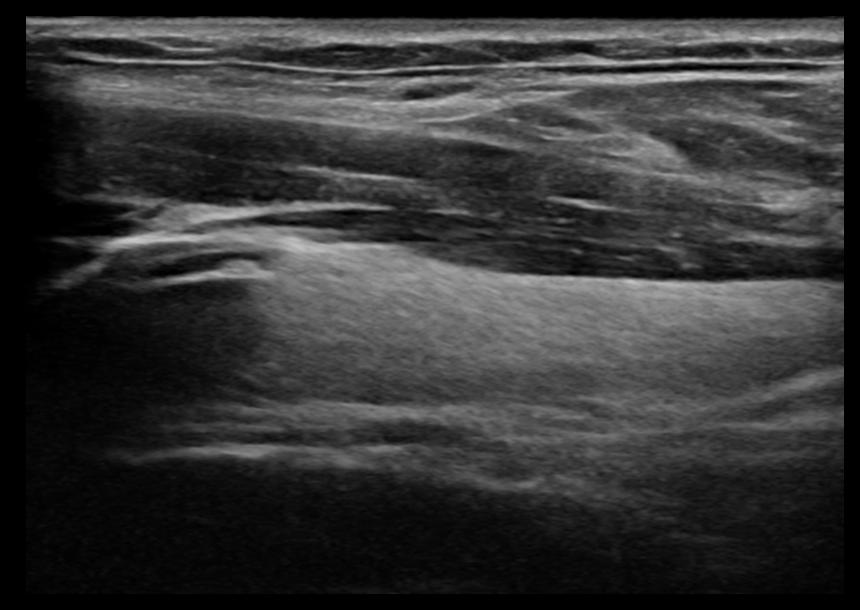
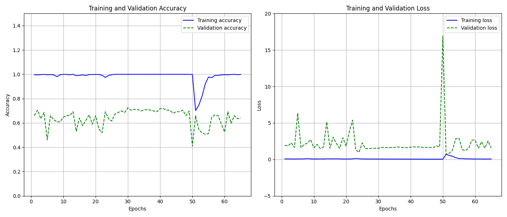
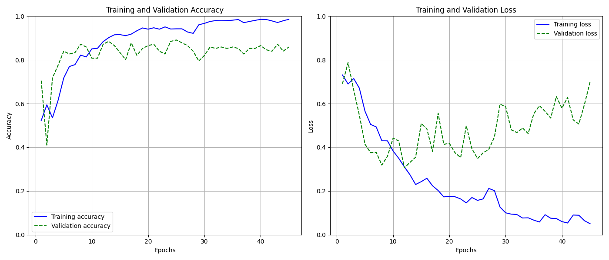
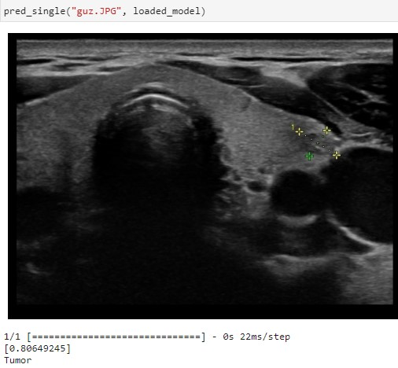

# Thyroid Tumor Classification Using Ultrasound Images

## Introduction

This project focuses on the binary classification of thyroid tumors using ultrasound images. 
Various machine learning approaches were employed, including convolutional neural networks (CNNs) with custom architectures, 
established CNN models such as VGG16 and ResNet50, as well as feature extraction techniques integrated with classifiers 
like Random Forest, XGBoost, Support Vector Machines (SVM), Logistic Regression, and K-Nearest Neighbors (KNN) derived from convolutional filters. 

The objective of this project is to provide a practical tool that can be utilized in clinical settings to expedite the diagnostic process for medical professionals. 
By offering an initial assessment, the system aims to serve as an aid, giving doctors a preliminary indication of potential issues. 
The successful completion of this project was made possible through the support of Comtegra S.A. 
and the computational resources provided by Comtegra GPU Cloud, which were essential due to the significant processing power required.


## Data Overview

The dataset utilized for this project is diverse, comprising 1,557 ultrasound images of the thyroid. 
These images are captured from three distinct perspectives: a frontal view showing the entire thyroid, a view of the left lobe, 
and a view of the right lobe of the thyroid gland. Approximately one-fourth of the images have tumors marked with crosses, 
while the remaining images do not have such annotations.

The classification task presents significant challenges, as it is difficult for an untrained observer to distinguish between images with and without tumors. 
Various elements within the images can be misleading, making it hard to discern patterns that indicate the presence of a tumor. 
Additionally, some images contain signs of inflammation, which are relatively easier to identify compared to tumors. 
Sample images, both with and without annotations, are presented in **Figure 1**.


<table align="center">
  <tr>
    <td colspan="2" align="left"><strong>Figure 1:</strong> Sample dataset images</td>
  </tr>
  <tr>
    <td></td>
    <td></td>
  </tr>
  <tr>
    <td></td>
    <td></td>
  </tr>
</table>


The dataset contains a higher proportion of images with tumors than without. 
Specifically, there are 916 images showing tumors and 641 images without any visible tumors. 
The distribution of the data is illustrated in **Figure 2**.


<table align="center">
  <tr>
    <td colspan="2" align="left"><strong>Figure 2:</strong> Data distribution</td>
  </tr>
<tr><td align="center" width="500">

</td></tr></table>

## Data Preparation and Preprocessing

The dataset was initially loaded using the `keras.utils.image_dataset_from_directory` function with the arguments `batch_size=None` and `shuffle=False`. 
These specific settings were necessary to address issues encountered when the data was shuffled during each iteration, 
leading to inconsistencies in the training, validation, and test sets. To ensure consistent datasets, images and labels were manually stored in arrays and shuffled independently.

### Data Splitting and Batch Configuration

The data was split into three subsets: 80% for training, 10% for validation, and 10% for testing. 
Given the relatively small size of the dataset, a larger proportion was allocated to training to maximize the amount of data available for model learning. 
During the initial experiments, setting the `batch_size` parameter at the dataset loading stage led to issues where batches contained only images from one class (either all positive or all negative). 
This could have caused serious learning problems, such as the training set being biased toward non-tumor images. 
After several trials, a batch size of 10 was chosen for optimal performance.

### Normalization and Data Augmentation

The images were normalized by mapping pixel values to the interval [0, 1]. Data augmentation was applied to help prevent overfitting, 
a significant issue encountered during initial training attempts. Various augmentation techniques were tested, including random flips, brightness adjustments, and contrast variations. 
Based on multiple experiments, vertical flips were excluded, as flipping the images upside down did not provide meaningful transformations for this context. 
Conversely, random brightness and contrast adjustments proved beneficial, as they could enhance the visibility of tumors by altering the image's lighting and sharpness. 

This approach was particularly useful because varying the brightness and contrast helped the model to better recognize subtle features that might indicate the presence of a tumor. 
These adjustments aimed to improve the model's ability to detect tumors that might otherwise be difficult to see.
The augmentation was dynamically adjusted throughout the training process by implementing a function that allows for easy modification of augmentation parameters. Below is a sample of the augmentation function:

```python
def create_augmentation(brightness_factor, contrast_factor):
    return tf.keras.Sequential([
        tf.keras.layers.RandomFlip('horizontal'),
        tf.keras.layers.RandomBrightness(factor=brightness_factor),
        tf.keras.layers.RandomContrast(factor=contrast_factor)
    ])
```

Sample of images after applied augmentation techniques are presented on **Figure 3**.

<table align="center">
  <tr>
    <td colspan="2" align="left"><strong>Figure 3:</strong> Augmented images</td>
  </tr>
<tr><td align="center" width="9999">

</td></tr></table>

### Class Imbalance and Weighting

Given the imbalance between classes (with more images showing tumors than without), class weighting was employed during model training to ensure balanced learning.
By assigning higher weights to the less frequent class (images without tumors), the model was encouraged to treat both classes more equally, 
preventing bias towards the majority class.

To address this imbalance, class weights were computed using the `class_weight.compute_class_weight` function from `sklearn`, 
which calculates weights based on the distribution of classes in the training data. The following code snippet demonstrates how the class weights were determined:

```python
y_train = np.concatenate([y for x, y in train_data])
class_weights = class_weight.compute_class_weight(
    class_weight='balanced',
    classes=np.unique(y_train),
    y=y_train
)
class_weight_dict = dict(enumerate(class_weights))
```

The computed class weights were: `non-tumor: 1.213, tumor: 0.850`.

### Overfitting Mitigation Strategies

Overfitting posed a significant challenge throughout the project. To address this, several techniques were implemented, including:

* **L2 Regularization**: Applied with a parameter of 0.0002 for custom CNNs and 0.0001 for other models.
* **Batch Normalization**: Included to stabilize learning and improve training speed.
* **Dropout Layers**: Set at 0.3 to reduce overfitting by randomly deactivating certain neurons during each training step. 
* **Global Average Pooling 2D**: Used to reduce the number of parameters and prevent overfitting.
* **Early Stopping**: Incorporated with the `restore_best_weights` parameter, ensuring that the best-performing model weights were saved. 
This was particularly useful because the models were trained for up to 150 epochs, and early stopping prevented unnecessary prolonged training while avoiding the need for continuous model saving.

### Model Interpretation

To further understand the model's decision-making process, Grad-CAM (Gradient-weighted Class Activation Mapping) was utilized. 
This technique allows for the visualization of the areas within the image that the model focused on when making predictions. 
By highlighting the regions of interest, Grad-CAM helped to identify which parts of the ultrasound images were most influential in the model's decision-making. 
**Figure 4** illustrates sample images showing Grad-CAM results on the test dataset. The heatmaps illustrate where the model concentrated its attention while predicting the presence of a tumor:

<table align="center">
  <tr>
    <td colspan="3" align="left"><strong>Figure 4:</strong> Visualization of Model Predictions </td>
  </tr>
  <tr>
    <td align="center">
      
    </td>
    <td align="center">
      
    </td>
    <td align="center">
      
    </td>
  </tr>
</table>

During analysis, it was observed that the model sometimes focused on irrelevant features, such as text or numbers below the images, 
instead of the actual regions of interest (e.g., the tumor areas). This led to misleading predictions and incorrect model attention. 
To address this issue, a cropping operation was introduced to eliminate unnecessary elements and ensure that the predictions were based solely on relevant visual data.

**Figure 5** demonstrates how the cropping process was applied to remove misleading areas, resulting in a cleaner dataset. 
By focusing the model's attention on the core regions of interest, this adjustment helped to improve prediction accuracy and reduce the influence of distracting elements. 

<table align="center">
  <tr>
    <td colspan="3" align="left"><strong>Figure 4:</strong> Grad-CAM visualization of model predictions </td>
  </tr>
  <tr>
    <td align="center">
      
    </td>
    <td align="center">
      
    </td>
    <td align="center">
      
    </td>
  </tr>
</table>

The combination of Grad-CAM visualization and image preprocessing provided a more refined approach to model interpretation and data preparation.

## Models training and evaluation

### Custom CNN Model

A custom Convolutional Neural Network (CNN) was developed for the classification task, with the following architecture (see **Figure 6**):

<table align="center">
  <tr>
    <td colspan="2" align="left"><strong>Figure 6:</strong> Custom CNN Architecture</td>
  </tr>
<tr><td align="center" width="400">

</td></tr></table>

A grid search over learning rates was performed to identify the optimal rate. 
Different values were tested, with the model training for up to 150 epochs per configuration, using `EarlyStopping` to halt training if there were no improvements. 
Based on the performance, the best learning rate was found to be **0.00027**.

After hyperparameter tuning, the model was retrained using the selected learning rate of `0.00027`. 
The custom CNN struggled to achieve strong performance required in the medical field, with a final validation accuracy of `88.5%` and a test accuracy of `87.3%`.
Despite the use of regularization techniques, the model exhibited signs of overfitting, and its simplicity may have limited its ability to learn complex features effectively.

The following plots illustrate the training and validation accuracy, as well as the loss over epochs (see **Figure 7**):

<table align="center">
  <tr>
    <td colspan="2" align="left"><strong>Figure 7:</strong> Training and Validation Accuracy and Loss Over Epochs</td>
  </tr>
<tr><td align="center" width="800">

</td></tr></table>

* **Accuracy**: While the training accuracy was consistently high, the validation accuracy fluctuated significantly, suggesting that the model was not generalizing well. 
This may indicates signs of overfitting, where the model memorized patterns in the training data but failed to capture the underlying features necessary for accurate predictions on new data.

* **Loss**: The validation loss spiked at multiple points, further confirming the inconsistency in learning. Despite regularization, 
the model's simple architecture may have been insufficient to capture the nuances of the ultrasound images, leading to unstable performance.

The confusion matrices in **Figure 8** illustrate the performance of the custom CNN on the validation and test sets:

<table align="center">
  <tr>
    <td colspan="2" align="left"><strong>Figure 8:</strong> Custom CNN Confusion Matrices</td>
  </tr>
<tr><td align="center" width="800">

</td></tr></table>

Overall, the custom CNN model did not perform as well as anticipated. Its relatively simple architecture, 
while may be effective for basic tasks, may have been inadequate for this complex classification problem. 
The spikes in validation loss and fluctuating accuracy suggest that the model was unable to generalize effectively. 
More sophisticated architectures or deeper networks might be required to improve performance.

### **VGG16**

The VGG16 model was employed using transfer learning, leveraging a pre-trained version of the network with weights initialized from the `ImageNet` dataset. 
This approach allowed the model to use learned features from a broad range of images, which was particularly useful given the complexity of the task. 
The architecture was modified as follows: 
1. **Base Model**: The VGG16 network was loaded without its top layers, using `include_top=False`. The input shape was set to `(256, 256, 3)` to match the dimensions of the ultrasound images.
2. **Custom Layers**: A `GlobalAveragePooling2D` layer was added to reduce the dimensions of the feature maps, followed by a fully connected dense layer with 256 neurons and ReLU activation. 
There was a reduction in the number of neurons in the first Dense layer to 128 from 256 to prevent overfitting. It didn’t help a lot and it was better in predicting non-tumor classes, on the other hand worse in tumor, so the changes were not saved.
A final output layer with a sigmoid activation was used for binary classification.
3. **Trainable Layers**: All layers of the base model were set to be trainable, enabling fine-tuning to adapt the pre-trained weights to the specific nuances of the thyroid ultrasound images.
```python
# Load pretrained VGG16 model and build transfer learning architecture
base_model = VGG16(weights='imagenet', include_top=False, input_shape=(256, 256, 3))
x = base_model.output
x = GlobalAveragePooling2D()(x)
x = Dense(256, activation='relu', kernel_regularizer=regularizers.l2(0.0001))(x)
predictions = Dense(1, activation='sigmoid')(x)
transfer_model = Model(inputs=base_model.input, outputs=predictions)
```

The final model architecture presented on **Figure 9**.

<table align="center">
  <tr>
    <td colspan="2" align="left"><strong>Figure 9:</strong> VGG16 Architecture</td>
  </tr>
<tr><td align="center" width="400">

</td></tr></table>

A grid search over learning rates was performed, ranging from `0.00004` to `0.00005`.
Results of the grid search presented on **Table 1**.

<table>
    <tr>
        <th colspan="4" align="left">Table 1: Results for Grid Search over Learning Rates</th>
    </tr>
    <tr>
        <th>Index</th>
        <th>Learning Rate</th>
        <th>Accuracy Validation</th>
        <th>Accuracy Test</th>
    </tr>
    <tr>
        <td>0</td>
        <td>0.000040</td>
        <td>0.884615</td>
        <td>0.871795</td>
    </tr>
    <tr>
        <td>1</td>
        <td>0.000041</td>
        <td>0.878205</td>
        <td>0.865385</td>
    </tr>
    <tr>
        <td>2</td>
        <td>0.000042</td>
        <td>0.891026</td>
        <td>0.897436</td>
    </tr>
    <tr>
        <td>3</td>
        <td>0.000043</td>
        <td>0.897436</td>
        <td>0.858974</td>
    </tr>
    <tr>
        <td>4</td>
        <td>0.000044</td>
        <td>0.910256</td>
        <td>0.852564</td>
    </tr>
    <tr>
        <td>5</td>
        <td>0.000046</td>
        <td>0.878205</td>
        <td>0.871795</td>
    </tr>
    <tr>
        <td>6</td>
        <td>0.000047</td>
        <td>0.884615</td>
        <td>0.865385</td>
    </tr>
    <tr>
        <td>7</td>
        <td>0.000048</td>
        <td>0.903846</td>
        <td>0.846154</td>
    </tr>
    <tr>
        <td>8</td>
        <td>0.000049</td>
        <td>0.891026</td>
        <td>0.871795</td>
    </tr>
    <tr>
        <td>9</td>
        <td>0.000050</td>
        <td>0.884615</td>
        <td>0.871795</td>
    </tr>
</table>

The best results were obtained with a learning rate of `0.000042`, which was then used to retrain the model with `EarlyStopping` to prevent overfitting.

The final training with the selected learning rate yielded a validation accuracy of `92.3%` and a test accuracy of `95.5%`. 
This marked a significant improvement over the custom CNN, demonstrating the effectiveness of transfer learning and fine-tuning.
**Figure 10** show the training and validation accuracy, as well as the loss over epochs, highlighting the model's learning progression:

<table align="center">
  <tr>
    <td colspan="2" align="left"><strong>Figure 10:</strong> Training and Validation Accuracy and Loss Over Epochs</td>
  </tr>
<tr><td align="center" width="800">

</td></tr></table>

- **Accuracy**: The model achieved high and relatively stable accuracy across both training and validation datasets, suggesting good generalization. 
The consistent improvement in accuracy demonstrates that the VGG16 architecture effectively learned to distinguish between tumor and non-tumor classes.
- **Loss**: The loss curves indicate that the model converged smoothly, with no significant spikes or indications of overfitting.

The confusion matrices on **Figure 11** provide insight into the model's performance on the validation and test sets:

<table align="center">
  <tr>
    <td colspan="2" align="left"><strong>Figure 11:</strong> VGG16 Confusion Matrices</td>
  </tr>
<tr><td align="center" width="800">

</td></tr></table>

The VGG16 model exhibited strong predictive performance, with a high true positive and true negative count on both the validation and test sets. 
The low number of false positives and false negatives reflects the model's ability to correctly classify tumor and non-tumor images, 
reinforcing its effectiveness in a medical diagnostic setting. However, the model showed a slight tendency to misclassify tumor images as non-tumor, which can be critical in the field of oncology, 
as it may lead to missed diagnoses. This highlights the importance of double-checking by professionals to ensure accurate detection and avoid potential oversights.

## Random Forest Classifier with VGG16 Features


The Random Forest model was built using features extracted from the VGG16 model. Specifically, 
the trained VGG16 model was used as a feature extractor, leveraging the output of the GlobalAveragePooling2D layer to obtain high-level features for each image. 
These extracted features served as input for training the Random Forest classifier, allowing the model to take advantage of deep features without requiring additional convolutional layers.

```python
feature_extractor = Model(inputs=model_vgg16.input, outputs=model_vgg16.get_layer('global_average_pooling2d_2').output)
```

Hyperparameter tuning was conducted using Bayesian optimization with the following parameter search space (see **Table 2**):

<table>
    <tr>
        <th colspan="2" align="left"><strong> Table 2</strong>: Hyperparameter Search Space</th>
    </tr>
    <tr>
        <th>Parameter</th>
        <th>Values</th>
    </tr>
    <tr>
        <td>Number of Estimators</td>
        <td>[500, 1000, 1500, 2000, 2500, 3000]</td>
    </tr>
    <tr>
        <td>Max Features</td>
        <td>['sqrt', 'log2']</td>
    </tr>
    <tr>
        <td>Max Depth</td>
        <td>[5, 7, 9, 10, 11, 12]</td>
    </tr>
    <tr>
        <td>Criterion</td>
        <td>['gini', 'entropy']</td>
    </tr>
</table>

The optimal hyperparameters presented in **Table 3**:

<table>
    <tr>
        <th colspan="2" align="left"><strong> Table 3</strong>: Optimal Hyperparameters</th>
    </tr>
    <tr>
        <th>Parameter</th>
        <th>Optimal Value</th>
    </tr>
    <tr>
        <td>Criterion</td>
        <td>entropy</td>
    </tr>
    <tr>
        <td>Max Depth</td>
        <td>9</td>
    </tr>
    <tr>
        <td>Max Features</td>
        <td>sqrt</td>
    </tr>
    <tr>
        <td>Number of Estimators</td>
        <td>500</td>
    </tr>
</table>

The Random Forest model achieved high accuracy on both validation and test datasets:
- **Validation Accuracy**: 92.31%
- **Test Accuracy**: 95.51%

The confusion matrices displayed on **Figure 12** for the validation and test sets illustrate the model's predictive accuracy:

<table align="center">
  <tr>
    <td colspan="2" align="left"><strong>Figure 12:</strong> Random Forest Confusion Matrices</td>
  </tr>
<tr><td align="center" width="800">

</td></tr></table>

The Random Forest model, using features extracted from the VGG16 network, achieved impressive results, 
with a test accuracy of `95.5%`, closely mirroring the performance of the fine-tuned VGG16 model itself. 
It is worth noting, that Random Forrest model struggles more with identifying non-tumor class, in comparison with VGG16 model.

## XGBoost Model with VGG16 Features

Similar to the Random Forest model, the XGBoost model was trained using features extracted from the VGG16 network’s `GlobalAveragePooling2D` layer. 
Sample weights were also applied to address class imbalance, ensuring that the model treated each class appropriately. 

Hyperparameter tuning for the XGBoost model was conducted using grid search over the parameter space listed in **Table 4** below.

<table>
    <tr>
        <th colspan="2" align="left"><strong> Table 4</strong>: XGBoost Hyperparameter Search Space</th>
    </tr>
    <tr>
        <th>Parameter</th>
        <th>Values</th>
    </tr>
    <tr>
        <td>n_estimators</td>
        <td>[10, 100, 500, 1000]</td>
    </tr>
    <tr>
        <td>learning_rate</td>
        <td>[0.01, 0.1, 0.2]</td>
    </tr>
    <tr>
        <td>max_depth</td>
        <td>[3, 6, 10]</td>
    </tr>
    <tr>
        <td>min_child_weight</td>
        <td>[1, 5, 10]</td>
    </tr>
    <tr>
        <td>subsample</td>
        <td>[0.8, 0.9]</td>
    </tr>
</table>

The optimal hyperparameters found were (see **Table 5**):

<table>
    <tr>
        <th colspan="2">Table 5: Optimal XGBoost Hyperparameters</th>
    </tr>
    <tr>
        <th>Parameter</th>
        <th>Optimal Value</th>
    </tr>
    <tr>
        <td>learning_rate</td>
        <td>0.01</td>
    </tr>
    <tr>
        <td>max_depth</td>
        <td>3</td>
    </tr>
    <tr>
        <td>min_child_weight</td>
        <td>5</td>
    </tr>
    <tr>
        <td>n_estimators</td>
        <td>1000</td>
    </tr>
    <tr>
        <td>subsample</td>
        <td>0.9</td>
    </tr>
</table>


After training, the XGBoost model achieved a high validation and test accuracy:
- **Validation Accuracy**: 93.59%
- **Test Accuracy**: 94.87%

The classification report in **Table 6** for the test set and confusion matrices in **Figure 13** for both validation and test sets provides further details:

<table>
    <tr>
        <th colspan="5" align="left"><strong> Table 6:</strong> Classification Report for Test Set</th>
    </tr>
    <tr>
        <th>Class</th>
        <th>Precision</th>
        <th>Recall</th>
        <th>F1-Score</th>
        <th>Support</th>
    </tr>
    <tr>
        <td>0</td>
        <td>0.90</td>
        <td>0.96</td>
        <td>0.93</td>
        <td>128</td>
    </tr>
    <tr>
        <td>1</td>
        <td>0.97</td>
        <td>0.93</td>
        <td>0.95</td>
        <td>184</td>
    </tr>
    <tr>
        <td><strong>Accuracy</strong></td>
        <td colspan="3"></td>
        <td>0.94</td>
    </tr>
    <tr>
        <td><strong>Macro Avg</strong></td>
        <td>0.94</td>
        <td>0.95</td>
        <td>0.94</td>
        <td>312</td>
    </tr>
    <tr>
        <td><strong>Weighted Avg</strong></td>
        <td>0.94</td>
        <td>0.94</td>
        <td>0.94</td>
        <td>312</td>
    </tr>
</table>

<table align="center">
  <tr>
    <td colspan="2" align="left"><strong>Figure 13:</strong> XGBoost Confusion Matrices</td>
  </tr>
<tr><td align="center" width="800">

</td></tr></table>

Additionally, the model achieved a **ROC AUC Score** of `94.51%`, indicating good performance in distinguishing between the tumor and non-tumor classes.

The XGBoost model, trained on VGG16 features, proved to be a powerful alternative to the fine-tuned VGG16 network, achieving comparable performance. 
This reinforces the value of combining feature extraction from pre-trained networks with traditional models in resource-limited environments. 

## Support Vector Machine (SVM) with VGG16 Features

Like the previous models, the SVM was trained using features extracted from the VGG16 model's `GlobalAveragePooling2D` layer. 
A grid search was conducted to tune the SVM’s hyperparameters over the parameter space presented in **Table 7**:

<table>
    <tr>
        <th colspan="2" align="left">Table 7: SVM Hyperparameter Search Space</th>
    </tr>
    <tr>
        <th>Parameter</th>
        <th>Values</th>
    </tr>
    <tr>
        <td>C</td>
        <td>[0.001, 0.01, 0.1, 1, 10, 100]</td>
    </tr>
    <tr>
        <td>kernel</td>
        <td>['linear', 'poly', 'rbf', 'sigmoid']</td>
    </tr>
    <tr>
        <td>degree</td>
        <td>[2, 3, 4, 5]</td>
    </tr>
    <tr>
        <td>gamma</td>
        <td>['scale', 'auto', 0.001, 0.01, 0.1, 1, 10, 100]</td>
    </tr>
    <tr>
        <td>coef0</td>
        <td>[0.0, 0.1, 0.5, 1.0]</td>
    </tr>
    <tr>
        <td>class_weight</td>
        <td>['balanced']</td>
    </tr>
</table>

The best parameters identified through grid search were:

<table>
    <tr>
        <th colspan="2" align="left">Table 8: Final SVM Hyperparameters</th>
    </tr>
    <tr>
        <th>Parameter</th>
        <th>Optimal Value</th>
    </tr>
    <tr>
        <td>C</td>
        <td>100</td>
    </tr>
    <tr>
        <td>class_weight</td>
        <td>balanced</td>
    </tr>
    <tr>
        <td>coef0</td>
        <td>1.0</td>
    </tr>
    <tr>
        <td>degree</td>
        <td>4</td>
    </tr>
    <tr>
        <td>gamma</td>
        <td>0.001</td>
    </tr>
    <tr>
        <td>kernel</td>
        <td>poly</td>
    </tr>
</table>

After training, the SVM model achieved high accuracy on both the validation and test datasets:
- **Validation Accuracy**: 92.31%
- **Test Accuracy**: 94.23%

The classification report for the test set provided on **Table 9**:

<table>
    <tr>
        <th colspan="5" align="left"> Table 9: Classification Report for Test Set</th>
    </tr>
    <tr>
        <th>Class</th>
        <th>Precision</th>
        <th>Recall</th>
        <th>F1-Score</th>
        <th>Support</th>
    </tr>
    <tr>
        <td>0</td>
        <td>0.88</td>
        <td>0.96</td>
        <td>0.92</td>
        <td>128</td>
    </tr>
    <tr>
        <td>1</td>
        <td>0.97</td>
        <td>0.91</td>
        <td>0.94</td>
        <td>184</td>
    </tr>
    <tr>
        <td><strong>Accuracy</strong></td>
        <td colspan="3"></td>
        <td>0.93</td>
    </tr>
    <tr>
        <td><strong>Macro Avg</strong></td>
        <td>0.93</td>
        <td>0.94</td>
        <td>0.93</td>
        <td>312</td>
    </tr>
    <tr>
        <td><strong>Weighted Avg</strong></td>
        <td>0.94</td>
        <td>0.93</td>
        <td>0.93</td>
        <td>312</td>
    </tr>
</table>

Additionally, the model achieved a **ROC AUC Score** of `93.70%`, which is close to results of previous models.

The confusion matrices for the validation and test sets are shown in **Figure 14**, providing insight into the model's predictions:

<table align="center">
  <tr>
    <td colspan="2" align="left"><strong>Figure 14:</strong> SVM Confusion Matrices</td>
  </tr>
<tr><td align="center" width="800">

</td></tr></table>

The SVM model demonstrated reliable predictive capability with high true positive and true negative rates. 
Similarly to Random Forest and XGBoost, SVM model struggles more to identify non-tumor images.

## K-Nearest Neighbors (KNN) and Logistic Regression

In addition to the previously detailed models, K-Nearest Neighbors (KNN) and Logistic Regression models were also trained using the features extracted from the VGG16 network. 
Both models achieved similar performance to the other classifiers, demonstrating the robustness of the VGG16 features across various machine learning algorithms.

## ResNet50 Transfer Learning Model 

The ResNet50 model was implemented using transfer learning, leveraging pre-trained weights from `ImageNet`. The architecture was modified in a similar way to VGG16 model.

```python
base_model = ResNet50(weights='imagenet', include_top=False, input_shape=(256, 256, 3))
x = base_model.output
x = GlobalAveragePooling2D()(x)
x = Dense(128, activation='relu', kernel_regularizer=regularizers.l2(0.0001))(x)
x = BatchNormalization()(x)
x = Dropout(0.3)(x)
predictions = Dense(1, activation='sigmoid')(x)
resnet_model = Model(inputs=base_model.input, outputs=predictions)
```

Data augmentation was applied, testing different values for brightness (`[0.2, 0.3]`) and contrast (`[0.1, 0.2, 0.3]`) to improve model generalization. 
The learning rate was fixed at `0.00004` after preliminary tuning. The model was trained with `EarlyStopping` with a patience of 30 epochs.

The final training run used data augmentation parameters of `brightness=0.2` and `contrast=0.3`. 
The ResNet50 model achieved the following accuracy:
- **Validation Accuracy**: 81.4%
- **Test Accuracy**: 86.5%

The training and validation accuracy and loss over epochs are visualized in **Figure 15**:

<table align="center">
  <tr>
    <td colspan="2" align="left"><strong>Figure 15:</strong> Training and Validation Accuracy and Loss Over Epochs</td>
  </tr>
<tr><td align="center" width="800">

</td></tr></table>

- **Accuracy**: The training accuracy approached 100% quickly, while validation accuracy peaked around 80%, 
which may indicate some degree of overfitting despite the use of regularization and data augmentation.
- **Loss**: The validation loss showed fluctuations, suggesting that the model struggled to generalize effectively.

The confusion matrices in **Figure 16** display the model’s predictions on the validation and test sets:

<table align="center">
  <tr>
    <td colspan="2" align="left"><strong>Figure 16:</strong> ResNet50 Confusion Matrices</td>
  </tr>
<tr><td align="center" width="800">

</td></tr></table>

The ResNet50 model demonstrated relatively balanced performance but showed a tendency to misclassify tumor class as non-tumor in the validation set. 
While the true positive rate was high, the false positive rate was slightly elevated, suggesting that the model might benefit from further tuning to improve specificity.

## MobileNetV2 Transfer Learning Model 

The MobileNetV2 model was implemented using transfer learning, leveraging pre-trained weights from `ImageNet`. The architecture was adjusted in the same way as VGG16 and ResNet50 models.

Data augmentation was applied to improve model generalization, with various values for brightness (`[0.05, 0.1, 0.15]`) and contrast (`[0.05, 0.1, 0.15]`). 

#### **Training and Evaluation Results**
The final training run used a brightness of `0.15` and a contrast of `0.1` with a learning rate of `0.0000625`. 
The classification report for the test set in **Table 10** presents model’s performance:

<table>
    <tr>
        <th colspan="5" align="left"> Table 10: Classification Report for Test Set</th>
    </tr>
    <tr>
        <th>Class</th>
        <th>Precision</th>
        <th>Recall</th>
        <th>F1-Score</th>
        <th>Support</th>
    </tr>
    <tr>
        <td>0</td>
        <td>0.88</td>
        <td>0.94</td>
        <td>0.91</td>
        <td>128</td>
    </tr>
    <tr>
        <td>1</td>
        <td>0.95</td>
        <td>0.91</td>
        <td>0.93</td>
        <td>184</td>
    </tr>
    <tr>
        <td><strong>Accuracy</strong></td>
        <td colspan="3"></td>
        <td>0.92</td>
    </tr>
    <tr>
        <td><strong>Macro Avg</strong></td>
        <td>0.92</td>
        <td>0.93</td>
        <td>0.92</td>
        <td>312</td>
    </tr>
    <tr>
        <td><strong>Weighted Avg</strong></td>
        <td>0.92</td>
        <td>0.92</td>
        <td>0.92</td>
        <td>312</td>
    </tr>
</table>

The model achieved an **ROC AUC Score** of 92.53%, indicating good discriminatory power between tumor and non-tumor classes.

The training and validation accuracy and loss over epochs are visualized in **Figure 17**:

<table align="center">
  <tr>
    <td colspan="2" align="left"><strong>Figure 17:</strong> Training and Validation Accuracy and Loss Over Epochs</td>
  </tr>
<tr><td align="center" width="800">

</td></tr></table>

- **Accuracy**: The training accuracy approached high values quickly, while validation accuracy plateaued around 90%, indicating a good fit.
- **Loss**: The validation loss curve showed fluctuations but remained relatively stable, suggesting that the model maintained generalization through regularization techniques.

The confusion matrices for the validation and test sets display the model’s predictive performance in **Figure 18**:

<table align="center">
  <tr>
    <td colspan="2" align="left"><strong>Figure 18:</strong> MobileNetV2 Confusion Matrices</td>
  </tr>
<tr><td align="center" width="800">

</td></tr></table>

The MobileNetV2 model performed well, with high true positive and true negative counts across both validation and test sets. 
A few non-tumor images were misclassified as tumors, but the false-negative rate remained low, 
which is crucial for medical applications where missed tumors could have serious implications.

## Best model results

<table align="center">
  <tr>
    <td colspan="2" align="left"><strong>Figure 19:</strong> VGG16 Single Photos Predictions</td>
  </tr>
  <tr>
    <td></td>
    <td></td>
  </tr>
  <tr>
    <td></td>
    <td></td>
  </tr>
</table>

The model classifies correctly 3 of 4 given photos. Second image contains crosses, but it is non-tumor which might be misleading for the model. 
To visualize how predictions are made Grad-CAM was implemented (heatmap with gradients based on convolutional filters).


<table align="center">
  <tr>
    <td colspan="2" align="left"><strong>Figure 20:</strong> Images without tumor</td>
  </tr>
  <tr>
    <td align="center" width="300"></td>
    <td align="center" width="300"></td>
  </tr>
</table>


<table align="center">
  <tr>
    <td colspan="2" align="left"><strong>Figure 21:</strong> Images with tumor</td>
  </tr>
  <tr>
    <td align="center" width="300"></td>
    <td align="center" width="300"></td>
  </tr>
</table>


The only image from those that was misclassified is a non-tumor image with crosses. 
What is interesting is that the prediction wasn’t based on crosses at all (see **Figure 20**).

# **Summary**

To sum up, the project shows promise in aiding doctors in diagnosing thyroid tumors, the tool should be used under professional supervision, 
as it is intended to assist, not replace, clinical judgment. 

The VGG16 model emerged as the best performer, it achieved the best accuracy about 94% on both validation and test sets and about 93% recall on tumor class, 
which means that only 7% of tumors weren’t detected. Other models learned on convolutional filters were slightly worse. 

Best score was achieved by making a lot of improvements, such as data augmentation, regularization, dropout layer, 
global average pooling layer, cropping images, experimenting with learning rate, l2 regularization, augmentation layers, neurons number and multiple models with different architectures. 
This comprehensive analysis and model evaluation demonstrate a robust approach to automating and improving the accuracy of thyroid tumor classification using ultrasound images.


